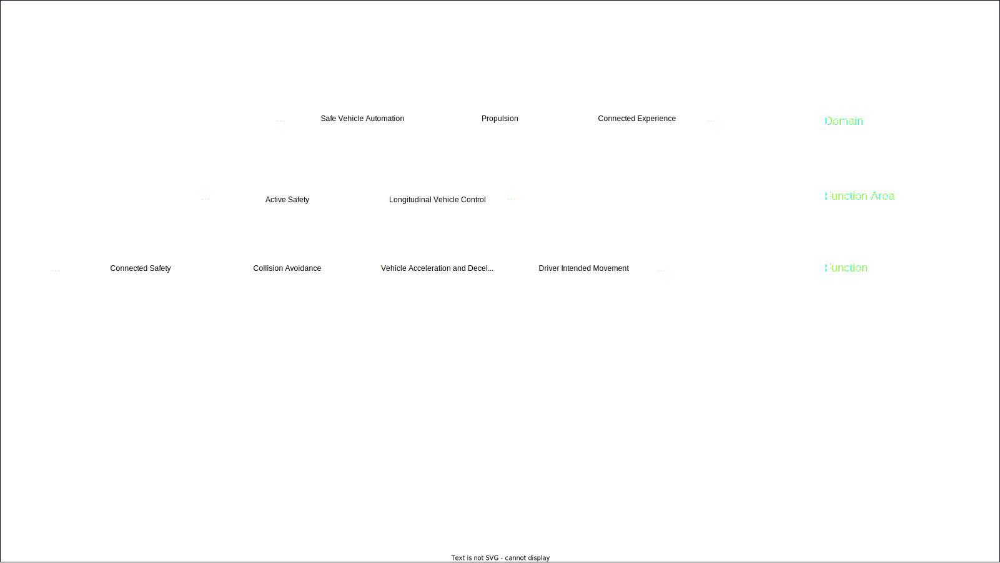

<!-- Uses MARP, see https://marp.app/ -->

<!--
class:
 - lead
 - invert
-->

# CDEventsCon

#### CI/CD for Autonomous Drive and Other Complex Systems

---
# "Nobody knows how to build a car..."

<!-- So I had just come out of this meeting where we were discussing something related to ... probably road safety or something. Anyway, I was chatting to Sabina, one of our test strategy experts, and the topic of variant handling came up because I had recently learned that with all the variants of all the components for different regions and  fuel sources and vehicle types etc. there were actually 4.2 BILLION different ways to combine things into a vehicle.

I was asking who decides what combinations of variants should be verified, because there is no way we are verifying all of them, and Sabina looked at me and said: "Erik, nobody knows how to build a car"

I remember thinking "That cannot be true, we are building cars every day", and I kind of categorized her statement as an exaggeration for effect and went on with my day.

Much much later, I have a came to a new understanding of "Nobody can build a car". It is not that it is impossible to build a car, it is that ... -->

---

<!-- ... no SINGLE PERSON knows how to build a whole car, with all the parts and all the software and all the configuration that goes into a modern vehicle. It's beyond anyones capacity to keep track of everything. So, a car gets build through collaboration, and collaboration requires communication.
-->

---
# CDEventsCon

#### CI/CD for Autonomous Drive and Other Complex Systems

##### (especially using events)

####

####

#### Erik Sternerson, doWhile

---

<!-- These are the kind of projects that occupy my daily work, specifically when it comes to enabling continuous integration and continuous delivery of software and hardware into these types of vehicles.
-->

---
<!--
_class:
 - invert
-->

# In this talk
<!-- Comment
-->

---

# Building Complex Systems

<!-- Systems can be complex for several reasons. They may have individual parts that are very advanced, for instance with complex algorithms or complex data structures. Or they can be complex because they have many parts that need to work together. The types of systems this talk will focus on has a little bit of both.
-->

---

<!-- So, we want to build, package and release and autonomus drive vehicle. Just selecting the latest and greatest of all harware and software components and putting everything together is very likely not going to work. 
Some components will not work that well together and it will be really hard to figure out which ones don't. 
Instead, we need to divide the work into smaller pieces.
-->

---

<!-- We'll start by defining a set of domains. These domains are pretty abstract groups of functionalty, and typically have on the order of 15-30 embedded computers and 30-60 developments teams under them. 

One such domain could be "Safe Vehicle Automation", ensuring that not only can the vehicle move, but it can do so without putting the driver or itself in danger.
-->

---

<!-- Next, we break each domain down into functionality areas. Now we are getting a bit more concrete, but the areas are still quite large. 2-6 embedded computers, 4-12 teams.
-->

---

<!-- So, we continue to break things down into functions. Here we get to something a bit more manageable, maybe 1 or 2 embedded computers, and 2-4 teams.
-->

---

<!-- And finally we get to an individual software component that implements one part of a function and goes on one embedded computer, typically developed by one development team. If we stop here, things still look reasonably manageable but unfortunately we have to also consider...
-->

---

<!-- ...that our software component needs to interact with other components in other functions in other domains.

So this means we cannot fully test our software component until we have most or all other components in the vehicle as well. But I said just a few minutes ago that we cannot just combine all the components together and test them, so we need to find another way...
-->

---

# Integrate

<!-- What we want to be able to do is to first take a small composition or subset of components, software and hardware, integrate them together and verify them, to smoke out the easy-to-discover issues. Then, we integrate this smaller composition with other compositions into a bigger composition and verify that. So on and so forth untill we have all the components in the same composition.
-->

---

<!-- Essentially, we will end up with something similar to the breakdown we just looked at, but in a sense of "building up" rather than "breaking down".
-->

---

# Continuously

<!-- So, we are integrating components into larger and larger compositions to be able to verify them in a sensible way, but do we want to do that only once or twice a month? Of course not, we want to do it as often as possible, for two reasons. 

One, the less time a developer has to wait for the verification of their change, the easier it will be for them to fix any issues that come up. 

Two, the fewer changes we introduce in any new composition we verify, the easier it will be to understand what changes may have contributed to the issue.

Ideally, we would start the process whenever there is a change anywhere, but we may have to settle for just doing it continuously using the resources we have.
-->

---

# Continuous ... Integration ... ?

<!-- So, the somewhat unfortunate term at least my part of the industry is using for this process is Continous Integration, and its unfortunate because it conflicts with the more official definition of the Continous Integration.
-->

---

# CDF: Continuous Integration

#### "the practice of merging all developer working copies to a shared mainline several times a day"

<!-- The CD Foundation defines Continuous Integration as "the practice of merging all developer working copies to a shared mainline several times a day", which is definitely related to what we are doing, but most our work starts after this "mainline" has been built and delievered. -->

---

# "Our" Continuous Integration

#### "frequently and iteratively integrate components together in increasingly complex compositions"

<!-- If I was to try to provide a definition for "Our" Continuous Integration, it would be something like

"frequently and iteratively integrate components together in increasingly complex compositions"

There is quite a bit to unpack here, so let's go term by term. -->

---

# freqently

<!-- TBW -->

---

# iteratively

<!-- TBW -->

---

# integrate

<!-- TBW -->

---

# components

<!-- TBW -->

---

# composition

<!-- TBW -->

---

# increasingly complex

<!-- TBW -->

---

#### "frequently and iteratively integrate components together in increasingly complex compositions"

<!-- With this definition in place, we are now ready to look at how events fit into this picture. -->

---

# Before events

---
<!--
_class:
 - invert
-->

# Before events

* ## Releases => File + e-mail

<!-- Hello -->

* ## Pipelines => Single Jenkins server

<!-- Hello -->

* ## Verification results => 